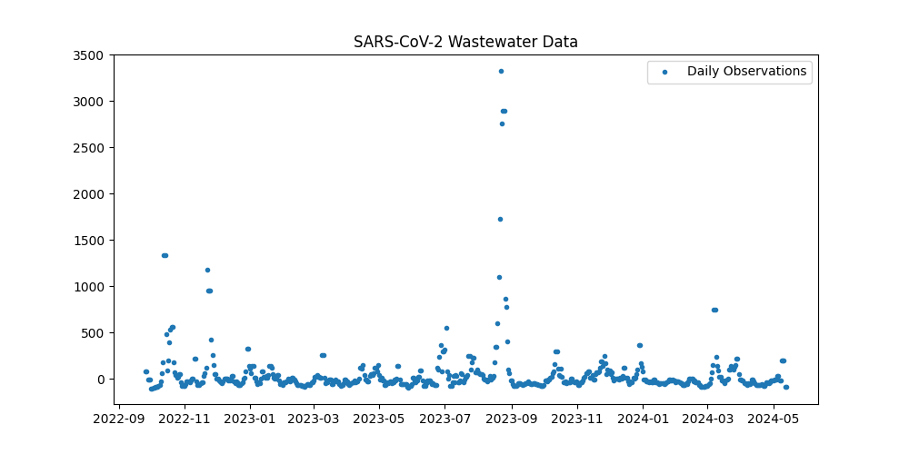
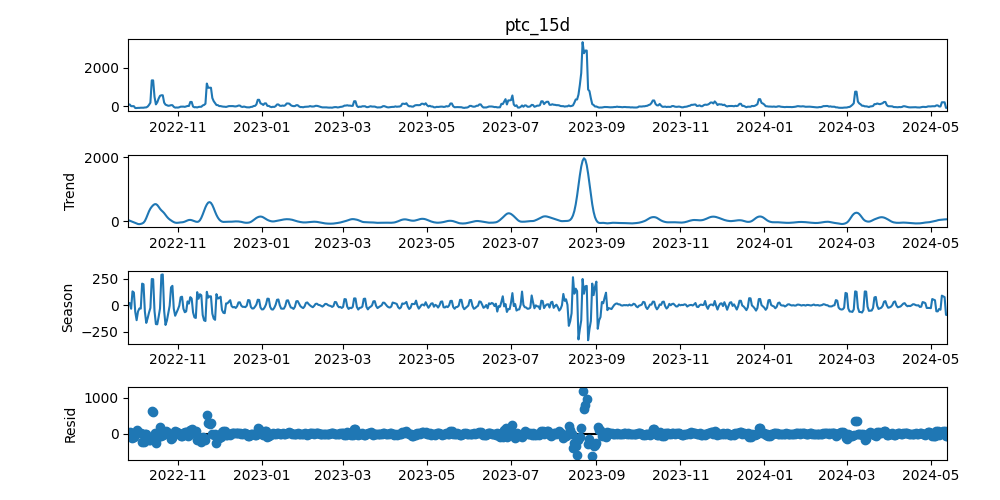
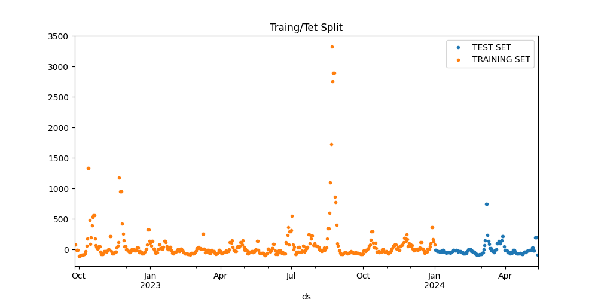
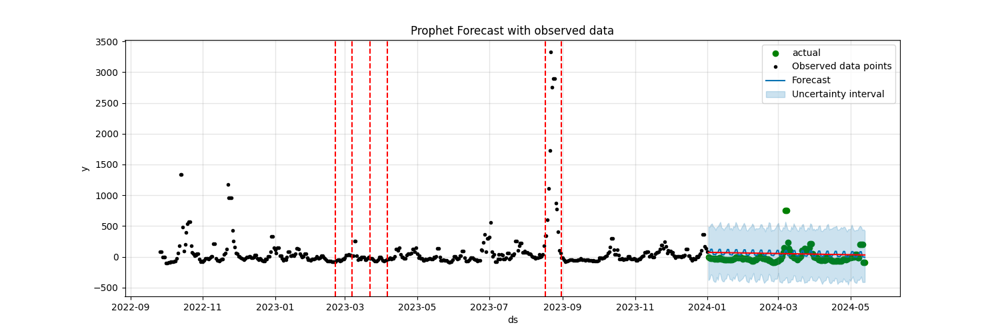
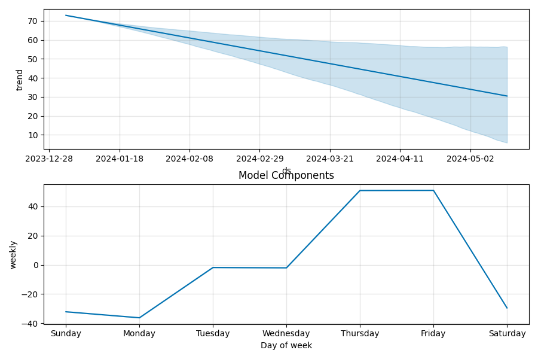

# forecasting_wastewater

A project on forecasting SARS-CoV-2 concentrations in wastewater at State College.

Data Used: [NWSS Public SARS-CoV-2 Wastewater Metric Data](https://data.cdc.gov/Public-Health-Surveillance/NWSS-Public-SARS-CoV-2-Wastewater-Metric-Data/2ew6-ywp6/about_data)

Provided By: National Wastewater Surveillance System

# Tools Used:
-   Time Series Analysis: Statsmodel, Facebook Prophet (Forecasting at Scale)
-   Machine Learning Development and Packaging: mlflow 
-   Containerization: Docker
-   Continuous Integration/ Continuous Development(CI/CD): Jenkins

# Results:

-  **Data Plot**: Plot of SARS-CoV-2 concentrations in wastewater across two years 

    

-   **Timeseries Decomposition**: Season-Trend decomposition of the timseries data

    

-   **Train Test Split**: Splitting the data for training and testing

    

-   **Prophet Forecast**: Prophet forecast with actual observations, changepoints and comparison with naive forecast

    

-   **Model Components**: Time series components learnt by Prophet Model

    

